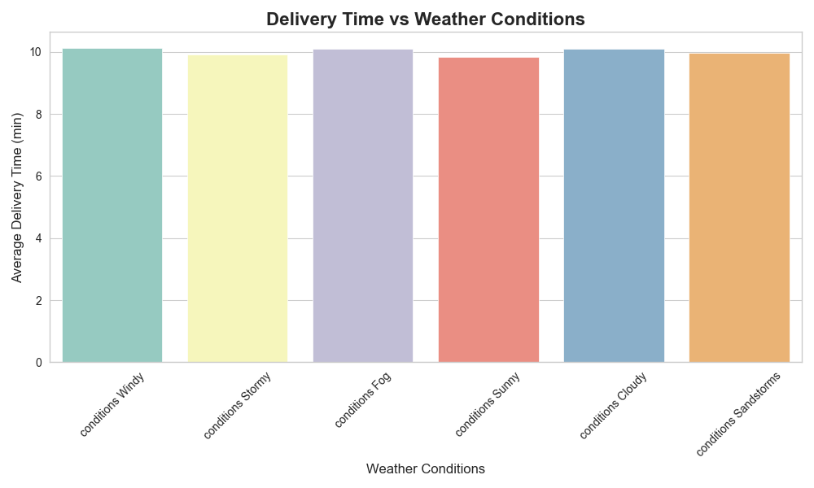
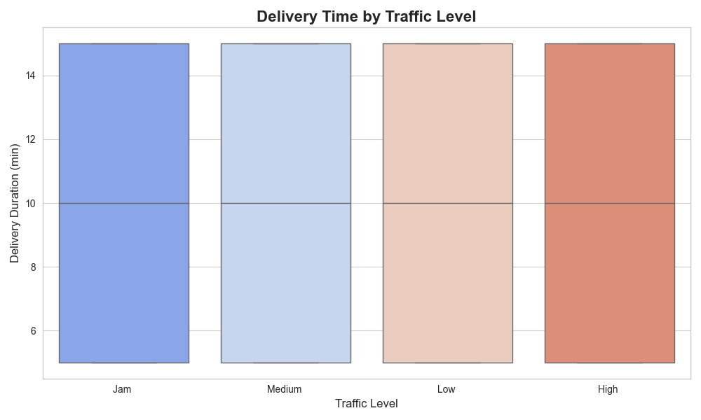
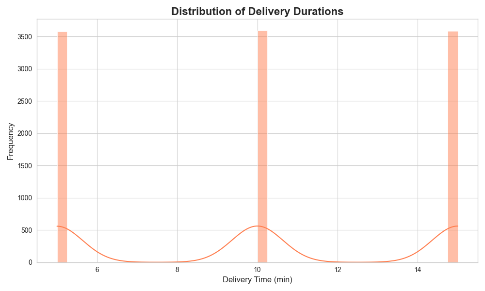

# 🛵 Food Delivery Time Analysis 📊

Analyzing how various factors such as weather and traffic affect food delivery duration using Python and real-world dataset.

---

## 📂 Dataset Info

- 🔢 Total Records: 11,399 rows × 19 columns  
- 📦 Key Columns:  
  - `Delivery_person_ID`  
  - `Time_Orderd`  
  - `Time_Order_picked`  
  - `Weatherconditions`  
  - `Road_traffic_density`  
  - `Delivery_Duration` (calculated)

---

## 🧹 Data Cleaning Steps
- Removed rows with missing or incorrect time entries.
- Converted time columns into datetime format.
- Created a new column `Delivery_Duration` (in minutes).

---

## 📊 Key Insights
- 🚴‍♀️ Top 5 fastest delivery people identified.
- ⛅ Weather like *Fog* or *Stormy* increased delivery time.
- 🚦 Traffic density like *Jam* delayed deliveries most.

---

## 📈 Visualizations
### 1. 📦 Delivery Time vs Weather Conditions  

### 2. 🚗 Delivery Time by Traffic  

### 3. ⏱️ Distribution of Delivery Durations  

---

## 🛠 Tools Used
- Python 🐍
- Jupyter Notebook 📓
- Pandas & NumPy 📊
- Matplotlib & Seaborn 📈

---

## 👩‍💻 Created By
**Madhavi Jitendra Balsara**  
Aspiring Data Analyst | Flutter Developer | Python Enthusiast  
📧 madhavibalsara07@gmail.com  
🔗 [LinkedIn](https://www.linkedin.com/in/madhavi-balsara)

---

## 🌟 Project Status
✅ Completed basic analysis  
✅ Uploaded to GitHub  
🚀 Open for improvements or extension
